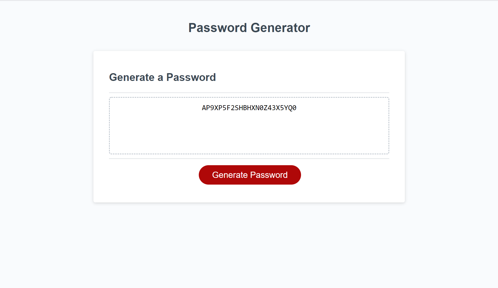

# Password Generator

An application allows an employee to generate a random password based on specific criteria they select.

## Description

This project was created to demonstrate the latest JavaScript concepts that were learned.  An application randomly generates a password for users by asking questions such as the length of the password, if the password should include uppercase or lowercase letters, if numbers should be included, or special characters.

### Built With
HTML
CSS
JavaScript

### Website
https://shannonposey.github.io/password-generator/

## Author
👤 **Shannon Posey**

* GitHub: [@ShannonPosey](https://github.com/ShannonPosey)
* LinkedIn: [@https:\/\/www.linkedin.com\/in\/shannonposey](https://linkedin.com/in/https:\/\/www.linkedin.com\/in\/shannonposey)

## 🤝 Contributing

Made by Shannon Posey

## 📝 License

Copyright © 2021 [Shannon Posey](https://github.com/ShannonPosey). 

***
